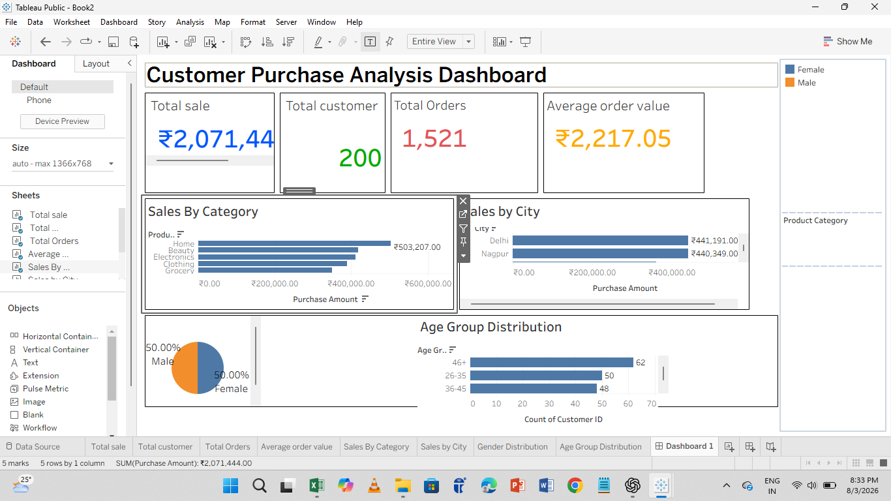

  

# Data Analytics Portfolio

Hi, I'm Vaishnavi Shitkal...

# 📊 Data Analytics Portfolio

Hi! I'm **Vaishnavi Shitkal**, an aspiring **Data Analyst** passionate about turning raw data into meaningful insights.

## 🛠 Skills

- 📈 Excel
- 📊 Power BI
- 🗄 SQL
- 🐍 Python
- 📉 Tableau
---

# 📊 Power BI Sales Dashboard

### 📌 Project Overview
This project analyzes sales performance using Power BI. It includes interactive dashboards with KPIs and visual reports.

### ✨ Key Features
- KPI Cards (Total Sales, Profit, Orders)
- Sales Trend Analysis
- Region-wise Sales
- Product Performance
- Customer Analysis
- Interactive Filters
- ## 📊 Power BI Dashboard

### 🛠 Tools Used
- Power BI
- Power Query
- DAX
- Excel

### 📷 Dashboard Screenshot
*(Upload your dashboard screenshot here)*

---

# 📈 Excel Dashboard

### 📌 Project Overview
Analyzed sales data using Microsoft Excel.

### ✨ Key Features
- Pivot Tables
- Charts
- Conditional Formatting
- VLOOKUP & XLOOKUP
- Data Cleaning

### 🛠 Tools Used
- Microsoft Excel

### 📷 Dashboard Screenshot
*(Upload Excel dashboard screenshot here)*
## 📈 Excel Dashboard

---

# 🗄 SQL Project

### 📌 Project Overview
Performed SQL operations on sample business datasets.

### ✨ Topics Covered
- CREATE TABLE
- INSERT
- UPDATE
- DELETE
- INNER JOIN
- LEFT JOIN
- GROUP BY
- HAVING
- Subqueries

### 🛠 Database
- MySQL

---
# 📊 Tableau Dashboard

### 📌 Project Overview
Created an interactive dashboard using Tableau to visualize sales data.

### 🛠 Tools Used
- Tableau

### 📷 Dashboard Screenshot

# 🐍 Python Project

### 📌 Project Overview
Performed data analysis using Python.

### ✨ Libraries Used
- Pandas
- NumPy
- Matplotlib

### Tasks Performed
- Data Cleaning
- Data Analysis
- Visualization

---

# 📬 Connect With Me

- 💼 LinkedIn: https://www.linkedin.com/in/vaishnavi-shitkal 
- 💻 GitHub: https://github.com/vaishnavishitkal

⭐ Thank you for visiting my portfolio!
